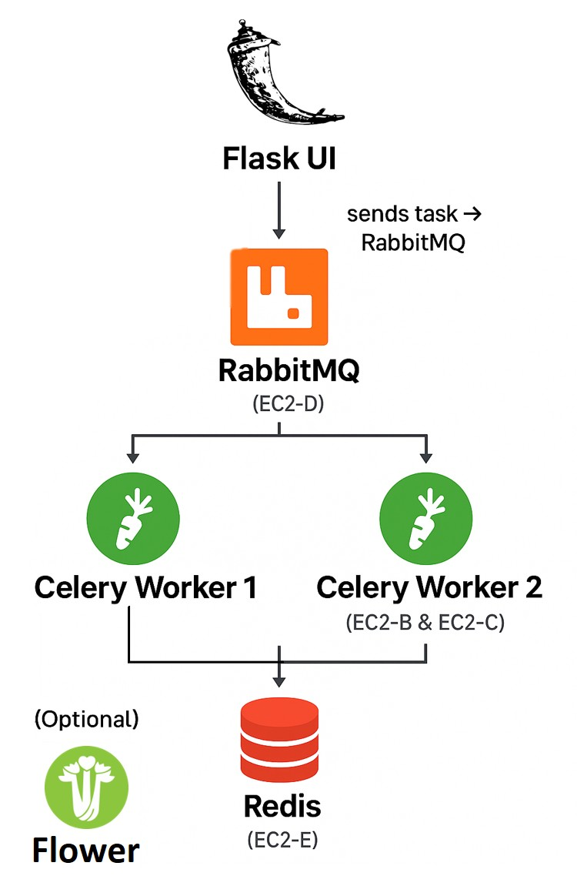

#  Asynchronous Task Processing System using  Pulumi-AWS Multi-EC2 Deployment

##  Project Overview
> Unlike monolithic deployments, this design runs each component in **separate EC2 instances** within a shared VPC , created and managed automatically using Pulumi:
- `flask-ec2`: Flask frontend/UI
- `rabbitmq-ec2`: Central message broker (Celery tasks get queued here)
- `redis-ec2`: Redis stores task results
- `worker1-ec2`, `worker2-ec2`: Celery workers (pull tasks from broker)
- `flower-ec2`: Task monitoring dashboard

All EC2s are Dockerized and orchestrated using `docker-compose` profiles.


##  Architecture Diagram


## How the System is Structured

### 🧱 Infrastructure (via `async-stack-Multi-EC2/__main__.py`)

1. **VPC Creation (`10.0.0.0/16`)**
   - Isolated virtual network for all EC2 instances.
   - DNS support is enabled for name resolution.

2. **Subnet (`10.0.1.0/24`)**
   - Public subnet for launching EC2s with public IPs.
   - `map_public_ip_on_launch=True` to auto-assign public IP.

3. **Internet Gateway**
   - Allows EC2s to access the internet (e.g., apt, pip, git, Docker).

4. **Route Table**
   - Routes all internet-bound traffic (`0.0.0.0/0`) through the Internet Gateway.

5. **Security Group**
   - Allows:
     - SSH (22)
     - Flask (5000)
     - RabbitMQ: AMQP (5672), UI (15672)
     - Flower dashboard (5555)
     - Redis (6379)
   - Allows all outbound traffic.

6. **SSH Key Pair**
   - Reads `~/.ssh/id_rsa.pub` to create a key pair for secure login.

7. **Docker Startup Scripts per EC2**
   - Uses a `make_script()` function to:
     - Install Docker & Compose
     - Clone GitHub repo
    - Injects rabbitmq_ip and redis_ip into celeryconfig.py
    - Builds and runs only the necessary service using docker-compose --profile <service>
This allows:
•	flask EC2 to run only Flask
•	worker1 and worker2 to run Celery workers
•	flower EC2 to monitor everything
•	Each EC2 gets only what it needs — reducing overhead

8. **Six EC2 Instances Created**
   - `rabbitmq-ec2`
   - `redis-ec2`
   - `flask-ec2`
   - `worker1-ec2`
   - `worker2-ec2`
   - `flower-ec2`

**The setup should show like this in AWS console:**


9.**Expose Public IPs for Access**
- Outputs the public IPs of all EC2s after deployment.
- Can directly visit:
  •	http://<flask-ip>:5000 → Flask UI
  •	http://<flower-ip>:5555 → Flower
  •	http://<rabbit-ip>:15672 → RabbitMQ dashboard


---

### 🐳 Docker Application (`async-tasks/docker-compose.yml`)

Each service has its own profile:

- `flask`: Flask app and task submission UI (port 5000)
- `rabbitmq`: Broker + management UI (5672, 15672)
- `redis`: Stores Celery task results (6379)
- `celery`: Worker consuming tasks (`-Q celery_see`)
- `flower`: Monitoring dashboard for Celery tasks (5555)

---
###  Optimized docker-compose.yml with profiles so each instance only spins up its assigned service:(Use profiles to isolate services)

```bash
version: "3.8"
services:
  flask:
    build: .
    profiles: ["flask"]
    volumes:
      - .:/code
    ports:
      - "5000:5000"
    depends_on:
      - rabbitmq
      - redis

  rabbitmq:
    image: rabbitmq:3-management
    profiles: ["rabbitmq"]
    ports:
      - "5672:5672"
      - "15672:15672"
    environment:
      RABBITMQ_DEFAULT_USER: guest
      RABBITMQ_DEFAULT_PASS: guest
    healthcheck:
      test: ["CMD", "rabbitmq-diagnostics", "ping"]
      interval: 30s
      timeout: 10s
      retries: 5

  redis:
    image: redis
    profiles: ["redis"]
    ports:
      - "6379:6379"

  celery:
    build: .
    profiles: ["celery"]
    depends_on:
      rabbitmq:
        condition: service_healthy
    restart: always
    command: >
      sh -c "sleep 5 && celery -A app.tasks worker -Q celery_see --loglevel=info --concurrency=4"

  flower:
    build: .
    profiles: ["flower"]
    ports:
      - "5555:5555"
    depends_on:
      rabbitmq:
        condition: service_healthy
    restart: always
    command: >
      sh -c "sleep 10 && celery -A app.tasks flower --port=5555"

```


### 🔗 Celery Configuration (`async-tasks/app/celeryconfig.py`)

```python
# Multi-Instance Config
broker_url = 'amqp://guest:guest@<BROKER_IP>:5672//'
result_backend = 'redis://<REDIS_IP>:6379/0'

task_serializer = 'json'
result_serializer = 'json'
accept_content = ['json']
timezone = 'Asia/Dhaka'
task_default_queue = 'celery_see'
```

This is automatically patched in each instance during boot with correct IPs of RabbitMQ and Redis.

---

## 📦 Folder Structure

```
async-tasks/
  ├── docker-compose.yml
  ├── app/
  │   └── celeryconfig.py

async-stack-Multi-EC2/
  ├── __main__.py
  ├── Pulumi.yaml
  ├── Pulumi.dev.yaml
  └── requirements.txt
```

---

##  Step-by-Step Setup (Local + AWS EC2 Deployment) : 


###  1. Prerequisites (on your machine)
Make sure you’ve:

AWS CLI installed 

Pulumi CLI installed 

Docker installed and working

~~ At First from the lab generate the Credentials get the access ID and Secret keys


~~ AWS Configuration from the terminal:
```bash

aws configure # Use credentials from Poridhi Lab or IAM keys

```
<div align="center">
  
</div>


### 📁 2.Initialize Pulumi Project
```bash
mkdir async-stack-Multi-EC2
cd async-stack-Multi-EC2
pulumi new aws-python

```
For First-time login need to generate tokens:

<div align="center">
  
</div>


**Respond to prompts:**

* Project name: async-task-infra

* Stack: dev (can create your new stack with name of desired)

* AWS region: ap-southeast-1 


## 3. Create Python Virtual Environment

On Debian/Ubuntu systems, you need to install the python3-venv
package using the following command.
-  1. Update your package index
```bash

sudo apt update
```
- 2. Install Python 3 and pip
```bash

sudo apt install -y python3 python3-pip
```
- 3. Install venv module for Python 3
```bash

sudo apt install -y python3-venv
```
>>If you're on Ubuntu 22.04 or later, these commands will work out of the box.

Then create a virtual environment:
```bash

python3 -m venv venv
```
- on Windows
```bash
venv\Scripts\activate    
```
- OR # on Linux/Mac
```bash
source venv/bin/activate  
```

Install required packages:
```bash
pip install pulumi pulumi_aws
# or
pip install -r requirements.txt
```
## 4. Define Infrastructure (__main__.py):

Replace __main__.py with this:

***here the modified app/celeryconfig.py in async-tasks and docker-compose.yml are pushed into a new repo https://github.com/MD-Junayed000/async-tasks-multi-EC2 and clone directly into the __main__.py.***

```bash

import pulumi
import pulumi_aws as aws
import os

# Ubuntu 22.04 AMI
ami = aws.ec2.get_ami(most_recent=True,
    owners=["099720109477"],
    filters=[{"name": "name", "values": ["ubuntu/images/hvm-ssd/ubuntu-jammy-22.04-amd64-server-*"]}]
)

# VPC & Networking
vpc = aws.ec2.Vpc("vpc",
    cidr_block="10.0.0.0/16",
    enable_dns_support=True,
    enable_dns_hostnames=True,
    tags={"Name": "async-vpc"}
)

# Subnet
subnet = aws.ec2.Subnet("subnet",
    vpc_id=vpc.id,
    cidr_block="10.0.1.0/24",
    map_public_ip_on_launch=True,
    tags={"Name": "async-subnet"}
)

# Internet Gateway
igw = aws.ec2.InternetGateway("igw",
    vpc_id=vpc.id,
    tags={"Name": "async-igw"}
)

# Route Table
route_table = aws.ec2.RouteTable("route-table",
    vpc_id=vpc.id,
    routes=[{
        "cidr_block": "0.0.0.0/0",
        "gateway_id": igw.id,
    }],
    tags={"Name": "async-rt"}
)

# Route Table Association
aws.ec2.RouteTableAssociation("route-table-assoc",
    subnet_id=subnet.id,
    route_table_id=route_table.id,
    opts=pulumi.ResourceOptions(additional_secret_outputs=["route_table_id"])
)


# Security Group
sec_group = aws.ec2.SecurityGroup("secgroup",
    vpc_id=vpc.id,
    description="Allow required ports",
    ingress=[
        {"protocol": "tcp", "from_port": 22, "to_port": 22, "cidr_blocks": ["0.0.0.0/0"]},
        {"protocol": "tcp", "from_port": 5000, "to_port": 5000, "cidr_blocks": ["0.0.0.0/0"]},
        {"protocol": "tcp", "from_port": 5555, "to_port": 5555, "cidr_blocks": ["0.0.0.0/0"]},
        {"protocol": "tcp", "from_port": 5672, "to_port": 5672, "cidr_blocks": ["0.0.0.0/0"]},
        {"protocol": "tcp", "from_port": 15672, "to_port": 15672, "cidr_blocks": ["0.0.0.0/0"]},
        {"protocol": "tcp", "from_port": 6379, "to_port": 6379, "cidr_blocks": ["0.0.0.0/0"]},
    ],
    egress=[{"protocol": "-1", "from_port": 0, "to_port": 0, "cidr_blocks": ["0.0.0.0/0"]}],
    tags={"Name": "async-secgroup"}
)

# SSH Key
key_pair = aws.ec2.KeyPair("ssh-key",public_key=open("/root/code/id_rsa.pub").read())

# startup script
def make_script(service, rabbitmq_ip="", redis_ip=""):
    # Determine which additional profiles are needed
    extra_profiles = ""
    if service == "flask" or service == "flower" or service == "celery":
       extra_profiles = "--profile rabbitmq --profile redis"

    return f"""#!/bin/bash
export DEBIAN_FRONTEND=noninteractive

# Install Docker + Compose v2
apt update -y
apt install -y docker.io git curl
systemctl start docker
usermod -aG docker ubuntu
sleep 30

# Install Docker Compose v2
curl -L https://github.com/docker/compose/releases/download/v2.24.5/docker-compose-$(uname -s)-$(uname -m) -o /usr/local/bin/docker-compose
chmod +x /usr/local/bin/docker-compose

# Setup project
cd /home/ubuntu
git clone https://github.com/MD-Junayed000/async-tasks-multi-EC2.git
cd async-tasks-multi-EC2

# Inject broker and redis IPs
sed -i 's|<BROKER_IP>|{rabbitmq_ip}|g' app/celeryconfig.py
sed -i 's|<REDIS_IP>|{redis_ip}|g' app/celeryconfig.py

# Logging everything
echo "==== STARTUP LOG for {service} ====" >> /home/ubuntu/startup.log
docker-compose {extra_profiles} --profile {service} build >> /home/ubuntu/startup.log 2>&1
docker-compose {extra_profiles} --profile {service} up -d >> /home/ubuntu/startup.log 2>&1
"""


#  EC2 instance function
def create_instance(name, script):
    return aws.ec2.Instance(name,
        ami=ami.id,
        instance_type="t2.micro",
        subnet_id=subnet.id,
        associate_public_ip_address=True, ### request a public IP address assigned by AWS during launch
        vpc_security_group_ids=[sec_group.id],
        key_name=key_pair.key_name,
        user_data=script,
        tags={"Name": name}
    )

# 1. RabbitMQ EC2
rabbitmq_script = make_script("rabbitmq")
rabbitmq = create_instance("rabbitmq-ec2", rabbitmq_script)

# 2. Redis EC2
redis_script = make_script("redis")
redis = create_instance("redis-ec2", redis_script)

# 3. Flask EC2
flask_script = pulumi.Output.all(rabbitmq.public_ip, redis.public_ip).apply(
    lambda ips: make_script("flask", ips[0], ips[1])
)
flask = create_instance("flask-ec2", flask_script)

# 4. Worker1 EC2
worker1_script = pulumi.Output.all(rabbitmq.public_ip, redis.public_ip).apply(
    lambda ips: make_script("celery", ips[0], ips[1])
)
worker1 = create_instance("worker1-ec2", worker1_script)

# 5. Worker2 EC2
worker2_script = pulumi.Output.all(rabbitmq.public_ip, redis.public_ip).apply(
    lambda ips: make_script("celery", ips[0], ips[1])
)
worker2 = create_instance("worker2-ec2", worker2_script)

# 6. Flower EC2
flower_script = pulumi.Output.all(rabbitmq.public_ip, redis.public_ip).apply(
    lambda ips: make_script("flower", ips[0], ips[1])
)
flower = create_instance("flower-ec2", flower_script)

# Outputs
pulumi.export("Flask Public IP", flask.public_ip)
pulumi.export("RabbitMQ IP", rabbitmq.public_ip)
pulumi.export("Redis IP", redis.public_ip)
pulumi.export("Worker1 IP", worker1.public_ip)
pulumi.export("Worker2 IP", worker2.public_ip)
pulumi.export("Flower IP", flower.public_ip)


```


### 5. Generating a valid SSH key and fixing the path.
***🔧 Step 1: Generate a Key Pair***

In the terminal (still in /root/code/):
```bash
ssh-keygen -t rsa -b 2048 -f /root/code/id_rsa -N ""
```
- This creates:

-- ✅ /root/code/id_rsa → private key

-- ✅ /root/code/id_rsa.pub → public key

***🔧 Step 2: Confirm the file exists***
```bash
ls -l /root/code/id_rsa.pub
```
should see a line like:
```bash
-rw------- 1 root root 426 Jun 4 10:23 /root/code/id_rsa.pub

```


## 6. Deploy Infrastructure
```bash

pulumi up --yes
```
you should see a output like this:
<div align="center">
  
</div>


 Going to take **2-3 mins for the entire system to setup** and the ports to bind and working

✅ You will get public_ip of the EC2 instance.

## 6. Monitor and Control:
SSH Into EC2 
```bash

ssh -i /root/code/id_rsa ubuntu@<public_ip>
```
🔒 Optional: Fix Permissions

If it still says “unprotected private key”, run:

```bash
chmod 400 /root/code/id_rsa
```
Then try again:
```bash
ssh -i /root/code/id_rsa ubuntu@<public_ip>
```

Then inside EC2 monitor which services are setup and there logs:

```bash

cat /home/ubuntu/startup.log
```
***Fetching Results via Redis***

```bash

ssh -i /root/code/id_rsa ubuntu@<Redis IP>
```
then see which container ID is open
```bash
docker ps
```
you should see a output like this:


then to query it inside run the command:
```bash
docker exec -it <name> redis-cli
```


## Internals — Task Flow
<div align="center">
  
</div>


•	RabbitMQ: Handles queues

•	Celery: Executes tasks

•	Redis: Stores task states & results

•	Flower: Visual task monitoring


##  What Happens Behind the Scenes

- **Pulumi provisions** a full cloud network and injects broker/result IPs into each EC2.
- **Each EC2** builds only its required service with Docker Compose profiles.
- **Workers connect** to RabbitMQ on a separate instance and store results in Redis on another instance.
- **Flask web UI** submits tasks and displays results using Redis.


##  Cleanup AWS Resources
```bash
pulumi destroy --yes
```


---

##  Summary

 This project showcases:
- **Distributed Celery architecture**
- **Full automation** with Pulumi (no manual AWS console clicks)
- **Service isolation** (1 EC2 per service)
- **Monitoring** via Flower
- **Scalable and modular async task processing**


